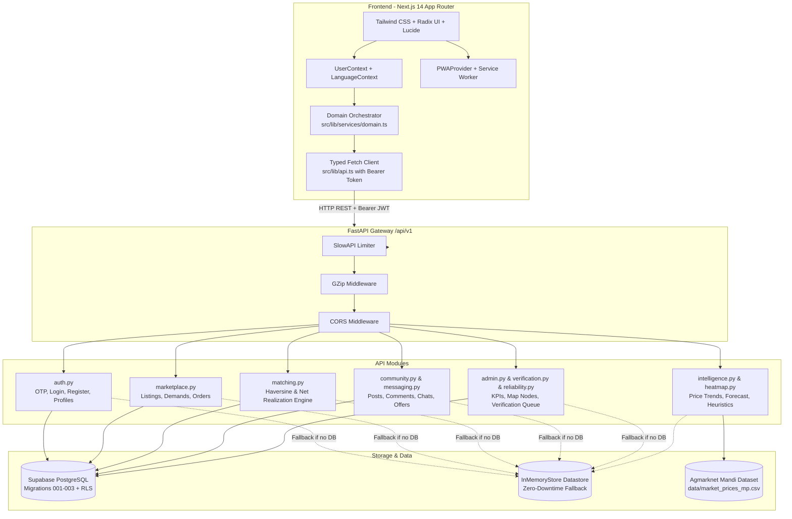
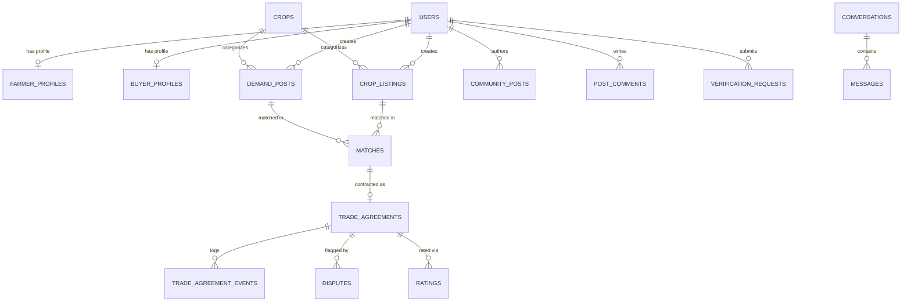

# Farm-Nex

**Direct agricultural marketplace and professional agri-network connecting farmers, FPOs, and bulk buyers with logistics-aware net realization matching, transparent mandi intelligence, and end-to-end deal execution.**

---

## 1. Overview

Agricultural trade in India is fragmented by multi-tiered intermediary brokerage, opaque mandi pricing, and deceptive gross bid quotes. When an industrial processor 180 km away offers ₹5,050/quintal while a local flour mill 35 km away bids ₹4,900/quintal, high road transport and loading expenses often render the distant bid significantly less profitable. Without accurate freight deductions factored in at spot negotiation time, smallholder farmers and Farmer Producer Organizations (FPOs) face unavoidable margin leakage or distress selling.

**Farm-Nex** solves this challenge through a **Logistics-Aware Matching Engine** that ranks buyer procurement demands by **Net Realization**—the actual take-home revenue per quintal after calculating spherical Haversine transport distance and tiered multi-axle freight costs.

Furthermore, Farm-Nex delivers **deterministic, transparent market intelligence** grounded in verified Government of India Agmarknet mandi auction records across Madhya Pradesh. Rather than relying on opaque or hallucinating generative AI models, Farm-Nex computes a dual-baseline 30-day statistical price forecast (Moving Average blended with Single Exponential Smoothing, $\alpha = 0.3$) and provides a rule-based economic explainer analyzing 14-day physical arrival volume shocks and statutory Minimum Support Price (MSP) benchmarks.

Built with **Next.js 14 (App Router)**, **FastAPI**, **Supabase PostgreSQL** (with an in-memory datastore fallback for instant zero-dependency local evaluation), and **PWA offline support**, Farm-Nex provides dedicated workspaces for Farmers, Bulk Buyers / Processors, FPOs, Consumers, and Platform Administrators.

---

## 2. Problem & Solution

### The Structural Problem in Agri-Commerce
1. **Gross Price Deception & Distance Decay**: Mandi headline rates hide hauling, handling, and distance deductions. Farmers cannot easily determine which buyer bid yields the highest take-home payout.
2. **Intermediary Margin Erosion**: Produce traverses 3 to 5 intermediary tiers (village aggregators, commission agents / *arhtiyas*, regional brokers), shedding ₹85 to ₹120 per quintal in commissions and repeated handling charges.
3. **Black-Box "AI Washing"**: Agricultural applications often claim generative AI price predictions that hallucinate forecasts without verifiable historical training baselines, leaving farmers exposed to market volatility.
4. **Informal & Vulnerable Trade Execution**: Trades negotiated over unrecorded phone calls lack contractual binding, dispute records, or verified weighbridge reconciliation, leading to default risks and delayed payments.

### The Farm-Nex Solution
- **Net Realization Ranking**: Every buyer opportunity computes highway haulage distance via the Haversine formula, calculates tiered freight, subtracts freight per quintal from the gross offer, and ranks bids strictly by take-home revenue.
- **Verifiable Mandi Analytics**: Historical mandi prices, 30-day trend forecasts, and price-movement explainers are computed using transparent mathematical models over official Agmarknet data.
- **Strict 8-Stage Trade Lifecycle**: Accepted matches transition through an enforced state machine with weighbridge receipts, delivery confirmations, bidirectional ratings, and administrative dispute management:
  $$\text{Matched} \rightarrow \text{Confirmed} \rightarrow \text{Pickup Scheduled} \rightarrow \text{Pickup Completed} \rightarrow \text{In Transit} \rightarrow \text{Delivered} \rightarrow \text{Payment Confirmed} \rightarrow \text{Completed}$$
- **Direct Multi-Role Network**: Integrates an agricultural community network with threaded replies, expert verification badges, direct messaging with counter-offer cards, and role-based workspaces.

---

## 3. Key Features by User Role

### 🌾 Farmer & FPO Capabilities
- **Crop Lot Listing**: Register harvest lots with commodity crop ID, quantity in quintals, quality grade (`Grade A`, `Grade B`, `Grade C`, `FAQ`), moisture percentage, harvest/availability dates, farm coordinates, expected price, pickup preference, and lot photos.
- **Smart Sell & Buyer Matching**: Discover active bulk buyer demands dynamically ranked by **Net Realization per Quintal** with breakdown of gross price, estimated freight, and human-readable match rationales.
- **Produce Management**: Track active, matched, in-transit, and delivered crop listings with instant withdrawal/deletion options (`/farmer/produce`).
- **FPO Collective Aggregation**: Monitor pooled member harvests, supply lots, collection centers, and logistics consolidation batches (`/fpo`).
- **Delivery & Payment Confirmation**: Confirm trade deliveries and acknowledge received bank payments directly on trade agreements.

### 🏭 Bulk Buyer & Processor Capabilities
- **Procurement Demand Broadcasting**: Post industrial requirements specifying target commodity, volume needed, acceptable quality grade, moisture ceiling, gross offered price, delivery yard location, and payment terms (`/buyer/requirements`).
- **Supply Discovery**: Browse verified regional crop listings with commodity, location, and seller verification filters (`/marketplace`).
- **Trade Execution & Delivery Confirmation**: Confirm trade agreements upon farmer acceptance, schedule farm-gate vehicle dispatch, and confirm weighbridge receipt at the factory gate (`/deals/[id]`).

### 👥 Social Network & Direct Negotiation
- **Community Discussion Board**: Create agronomic and trade discussions categorized by tags (`question`, `market`, `machinery`, `expert_verified`).
- **Threaded Replies & Reactions**: Participate in peer discussions, like posts, and post comments (`/network`).
- **Direct Messaging with Trade Offers**: Structured chat supporting standard text messages, formal purchase offers, counter-offers, and deal acceptance cards (`/messages`).
- **User Directory & Verification**: Search across registered producers, FPOs, and buyers by name, role, phone, or location, and view detailed user profiles with reliability scores (`/profile/[id]`).

### 🛡️ Administrative & Platform Operations
- **Surveillance KPIs**: Real-time aggregation of active listings, buyer demands, trade agreements, connected farmers/buyers, trade volume in quintals, and cumulative logistics savings in INR (`/admin`, `/admin/analytics`).
- **Geospatial Supply & Demand Map**: Spatial coordinate rendering mapping supply (farmer harvest lots) and demand (buyer processing plants) across regional trade corridors (`/admin`).
- **Dispute Resolution**: Review, investigate, and resolve commercial disputes raised over quality discrepancies or payment delays (`/admin/disputes`).
- **Trust & Verification Queue**: Inspect submitted business licenses, GST credentials, and farmer documents to approve or reject verification status (`/admin/trust`).
- **Expert Verification Badge**: Mark technically sound community advice with the platform's "Expert Verified" badge.

---

## 4. Current Tech Stack

### Frontend
- **Framework**: Next.js 14.2 (React 18, App Router)
- **Language**: TypeScript 5.4 (Strict mode enabled)
- **Styling**: Tailwind CSS 3.4, PostCSS, Class Variance Authority (`cva`), `clsx`, `tailwind-merge`
- **UI Primitives & Icons**: Radix UI (`@radix-ui/react-slot`), Lucide React
- **Data Visualization**: Recharts 2.12 (Historical modal price trends and arrival volume series)
- **Date Handling**: `date-fns` 4.4
- **Internationalization (i18n)**: Custom `LanguageContext` supporting English (`en`) and Hindi (`hi`)
- **PWA**: Web App Manifest (`/manifest.json`), service worker registration (`PWAProvider.tsx`), standalone display support
- **State & Data Layer**: Client `UserContext`, typed API client (`api.ts`), hybrid domain orchestrator (`domain.ts`) with in-browser test user directory

### Backend
- **Framework**: FastAPI 0.110+ (Python 3.10+)
- **Server**: Uvicorn (Standard ASGI with Gunicorn production support)
- **Validation & Serialization**: Pydantic v2 & Pydantic-Settings
- **Security & Authentication**: PyJWT (HS256 access & refresh tokens), Passlib with Bcrypt password hashing
- **Rate Limiting**: SlowAPI (10 req/min for authentication, 60 req/min default)
- **Middleware**: GZip response compression (responses > 500 bytes), CORS middleware
- **Data Analysis**: Pandas 2.2+, NumPy 1.26+
- **HTTP Client**: HTTPX 0.27+
- **Testing**: PyTest 8.0+, PyTest-Asyncio (29 automated unit & integration tests)

### Database & Persistence
- **Database**: Supabase PostgreSQL with custom ENUMs, relational foreign keys, cascade rules, and Row-Level Security (RLS) policies
- **Zero-Downtime In-Memory Fallback**: Built-in memory datastore (`app.core.database.InMemoryStore`) enabling complete offline evaluation without external credentials
- **Dataset**: Daily Agmarknet mandi auction records across Madhya Pradesh (`data/market_prices_mp.csv`)

---

## 5. System Architecture



### Key Architectural Flows
1. **Authentication Flow**:
   - Farmers authenticate via phone OTP (`/api/v1/auth/farmer/send-otp` and `/api/v1/auth/farmer/verify-otp`).
   - Bulk buyers and administrators authenticate via email and Bcrypt-hashed password (`/api/v1/auth/buyer/login`).
   - The server issues HS256-signed JWT access and refresh tokens. Authenticated requests pass the token in the `Authorization: Bearer <token>` header.
2. **Logistics & Matching Flow**:
   - Farm coordinates $(lat_1, lon_1)$ and buyer facility coordinates $(lat_2, lon_2)$ are evaluated using the spherical Haversine formula:
     $$d = 2R \cdot \arcsin\left(\sqrt{\sin^2\left(\frac{\Delta \text{lat}}{2}\right) + \cos(\text{lat}_1)\cos(\text{lat}_2)\sin^2\left(\frac{\Delta \text{lon}}{2}\right)}\right)$$
   - Road freight is calculated at ₹0.35/quintal-km for the first 100 km, with a 10% long-haul efficiency discount beyond 100 km (₹0.315/quintal-km), subject to a minimum charge of ₹25.00/quintal.
   - **Net Realization per Quintal** $= \text{Offered Price} - \text{Freight per Quintal}$.
   - Match score synthesizes net realization (45%), price (20%), distance (15%), quantity fit (8%), quality grade (5%), reliability (5%), and availability (2%).
3. **Market Intelligence & Price Forecast Flow**:
   - Pulls historical mandi modal prices and arrivals for Madhya Pradesh trading hubs.
   - Computes a deterministic 30-day price projection:
     $$\text{Forecast} = 0.65 \times \text{ExpSmooth}_{14\text{d}}(\alpha = 0.3) + 0.35 \times \text{MovingAvg}_{30\text{d}}$$
   - The economic explainer evaluates 14-day arrival volume elasticity ($>15\%$ surge vs $<-15\%$ contraction) against commodity statutory floors (e.g., Government MSP at ₹4,892/Q for Soybean).

---

## 6. Project Structure

```text
FARM-NEX/
├── backend/                              # FastAPI Python backend application
│   ├── app/
│   │   ├── api/                          # REST API modular route controllers
│   │   │   ├── admin.py                  # Macro platform surveillance & geographic map nodes
│   │   │   ├── agreements_expanded.py    # Delivery/payment confirmations & transaction ratings
│   │   │   ├── auth.py                   # Phone OTP, registration, login, profile updates, JWT refresh
│   │   │   ├── community.py              # Forum posts, threaded replies, likes, expert verification
│   │   │   ├── heatmap.py                # Regional supply/demand geospatial volume aggregation
│   │   │   ├── intelligence.py           # Agmarknet price trends, forecasting, why-price-moved
│   │   │   ├── marketplace.py            # Crop listings, demand posts, 8-stage trade agreements
│   │   │   ├── matching.py               # Haversine distance, freight tariff, net realization engine
│   │   │   ├── messaging.py              # Direct messaging, offer/counter-offer cards, conversations
│   │   │   ├── reliability.py            # User transaction reliability, quality score, rating metrics
│   │   │   ├── sms_provider.py           # SMS dispatch abstraction (Dev mode / Live gateway)
│   │   │   ├── user_search.py            # Query real users by name, phone, role, or location
│   │   │   └── verification.py           # KYC verification document queue and admin approvals
│   │   ├── core/                         # Core infrastructure & configuration
│   │   │   ├── config.py                 # App settings, matching weights, freight parameters
│   │   │   ├── database.py               # Supabase client & in-memory zero-dependency fallback store
│   │   │   ├── limiter.py                # SlowAPI rate limiter setup
│   │   │   ├── security.py               # Password hashing, JWT token creation/decoding, RBAC
│   │   │   └── seed_data.py              # Comprehensive seed data across MP districts
│   │   ├── models/
│   │   │   └── schemas.py                # Pydantic request and response schemas
│   │   └── main.py                       # FastAPI entrypoint, middleware, and lifespan tasks
│   ├── db/
│   │   └── schema.sql                    # Base PostgreSQL DDL schema definition
│   ├── tests/                            # Automated test suite (29 test cases)
│   │   ├── test_admin.py
│   │   ├── test_agreements_expanded.py
│   │   ├── test_auth.py
│   │   ├── test_heatmap.py
│   │   ├── test_intelligence.py
│   │   ├── test_intelligence_p5.py
│   │   ├── test_marketplace.py
│   │   ├── test_matching.py
│   │   ├── test_messaging.py
│   │   ├── test_phase5.py
│   │   ├── test_reliability.py
│   │   └── test_verification.py
│   ├── .env.example                      # Template backend environment variables
│   ├── pytest.ini                        # PyTest configuration
│   └── requirements.txt                  # Python dependencies
├── data/                                 # Market intelligence dataset & tools
│   ├── DATA_SOURCES.md                   # Public data citations (DMI Agmarknet, Govt of India)
│   ├── generate_dataset.py               # Dataset processing script
│   └── market_prices_mp.csv              # Historical mandi modal prices and arrival records
├── frontend/                             # Next.js 14 TypeScript web client
│   ├── public/
│   │   ├── manifest.json                 # Web App Manifest for PWA installation
│   │   └── icon-192.png                  # App icon
│   ├── src/
│   │   ├── app/                          # Next.js App Router route hierarchy
│   │   │   ├── admin/                    # Platform administration, analytics, disputes, trust queue
│   │   │   ├── buyer/                    # Bulk buyer workspace & procurement requirements
│   │   │   ├── consumer/                 # Direct-to-consumer catalog & local farm discovery
│   │   │   ├── deals/                    # Trade agreement lifecycle, milestones, weighbridge slips
│   │   │   ├── developer/                # Internal developer tools & rapid account switcher
│   │   │   ├── farmer/                   # Farmer dashboard, crop listings, and Smart Sell
│   │   │   ├── fpo/                      # FPO collective volume aggregation & collection centers
│   │   │   ├── login/                    # Dedicated role-based authentication page
│   │   │   ├── marketplace/              # Unified supply and demand discovery exchange
│   │   │   ├── messages/                 # Direct messaging & negotiation chat interface
│   │   │   ├── network/                  # Professional agri-network feed & connections directory
│   │   │   ├── notifications/            # Operational alerts (deals, logistics, market shifts)
│   │   │   ├── profile/                  # User public profile, badges, and reliability statistics
│   │   │   ├── layout.tsx                # Global shell, navbar, theme & PWA providers
│   │   │   └── page.tsx                  # Landing page with interactive demo authentication modal
│   │   ├── components/                   # Reusable UI components & dialogs
│   │   └── lib/                          # Client services, i18n, and authentication state
│   │       ├── api.ts                    # Typed REST API client
│   │       ├── auth/                     # UserContext, session storage, and route guards
│   │       ├── data/                     # Demo records and authenticated test user directory
│   │       ├── i18n/                     # Bilingual translation dictionary (English / Hindi)
│   │       ├── navigation.ts             # Role-based redirection and navigation links
│   │       └── services/domain.ts        # Hybrid data orchestrator (FastAPI with demo fallback)
│   ├── .env.example                      # Template frontend environment variables
│   ├── package.json                      # Frontend scripts and dependencies
│   ├── tailwind.config.ts                # Custom typography and agricultural theme tokens
│   └── tsconfig.json                     # TypeScript compiler configuration
├── supabase/                             # Cloud PostgreSQL database migrations
│   └── migrations/
│       ├── 001_initial_schema.sql        # Initial tables, ENUMs, and RLS policies
│       ├── 002_farmnex_expansion.sql     # Crops table, disputes, ratings, trade events
│       └── 003_social_trust_messaging.sql # Verification requests, messages, connections, post likes
└── README.md
```

---

## 7. API Reference

All backend endpoints are prefixed with `/api/v1` (configurable via `API_V1_STR`). Interactive OpenAPI Swagger documentation is available at `http://localhost:8000/docs`.

### Authentication & Profiles (`/auth`)
| Method | Endpoint | Description | Auth Required |
|---|---|---|---|
| `POST` | `/auth/farmer/send-otp` | Request phone OTP for farmer authentication (sends `123456` in dev) | No |
| `POST` | `/auth/farmer/verify-otp` | Verify OTP; returns JWT token if registered | No |
| `POST` | `/auth/farmer/register` | Register a new farmer with location coordinates and crop details | No |
| `POST` | `/auth/buyer/register` | Register a bulk buyer / business with company and GST details | No |
| `POST` | `/auth/buyer/login` | Authenticate buyer or admin with email and password | No |
| `GET` | `/auth/me` | Fetch authenticated user's profile | Bearer JWT |
| `PUT` | `/auth/me` | Update personal, farm, or business profile details | Bearer JWT |
| `POST` | `/auth/refresh` | Obtain a new access token using a valid refresh token | No |
| `GET` | `/auth/test-users` | Retrieve pre-seeded agricultural ecosystem test accounts | No |
| `POST` | `/auth/dev/switch-account` | Switch user context (restricted to admin/dev mode) | Bearer JWT (Admin) |

### Marketplace: Listings & Demands (`/marketplace`)
| Method | Endpoint | Description | Auth Required |
|---|---|---|---|
| `POST` | `/marketplace/listings` | Create a new farmer crop lot listing | Bearer JWT (Farmer/Admin) |
| `GET` | `/marketplace/listings` | Browse public crop listings with optional `crop_id` and `status` filter | No |
| `GET` | `/marketplace/listings/my` | Retrieve listings belonging to authenticated farmer | Bearer JWT |
| `DELETE` | `/marketplace/listings/{id}` | Delete or withdraw a crop listing (owner or admin) | Bearer JWT |
| `POST` | `/marketplace/demands` | Publish a bulk procurement requirement | Bearer JWT (Buyer/Admin) |
| `GET` | `/marketplace/demands` | Browse active buyer procurement demands | No |
| `GET` | `/marketplace/demands/my` | Retrieve demand requirements posted by authenticated buyer | Bearer JWT |
| `DELETE` | `/marketplace/demands/{id}` | Cancel or delete a procurement demand post | Bearer JWT |

### Logistics & Matching Engine (`/matching`)
| Method | Endpoint | Description | Auth Required |
|---|---|---|---|
| `GET` | `/matching/best-buyers/{listing_id}` | Calculate Haversine distance, freight, and net realization for matching buyers | Bearer JWT |
| `POST` | `/matching/accept` | Accept a match; generates binding digital trade agreement | Bearer JWT (Farmer/Admin) |

### Trade Agreements & Deal Lifecycle (`/marketplace/agreements`)
| Method | Endpoint | Description | Auth Required |
|---|---|---|---|
| `GET` | `/marketplace/agreements` | List trade agreements for authenticated user | Bearer JWT |
| `GET` | `/marketplace/agreements/{id}` | View single trade agreement detail and milestone audit trail | Bearer JWT |
| `PATCH` | `/marketplace/agreements/{id}/status` | Advance trade agreement status through the 8-stage state machine | Bearer JWT |
| `PATCH` | `/marketplace/agreements/{id}/delivery` | Confirm physical lot delivery (Buyer or Admin) | Bearer JWT |
| `PATCH` | `/marketplace/agreements/{id}/payment` | Confirm payment receipt (Farmer or Admin) | Bearer JWT |
| `POST` | `/marketplace/agreements/{id}/rate` | Submit star rating, quality score, and review for completed trade | Bearer JWT |

### Market Intelligence & Mandi Analytics (`/intelligence`)
| Method | Endpoint | Description | Auth Required |
|---|---|---|---|
| `GET` | `/intelligence/price-trend` | Historical daily Agmarknet mandi modal prices (1m, 3m, 6m, 1y) | No |
| `GET` | `/intelligence/demand-forecast` | 30-day statistical forecast (Moving Average + Exponential Smoothing $\alpha=0.3$) | No |
| `GET` | `/intelligence/why-price-moved` | Rule-based economic explainer analyzing 14d arrival elasticity and MSP | No |
| `GET` | `/intelligence/trending` | Top gainer and loser commodities by day-over-day and week-over-week change | No |
| `GET` | `/intelligence/heatmap` | Aggregated geospatial supply, demand, and trade volume intensity | No |

### Community & Social Network (`/community`)
| Method | Endpoint | Description | Auth Required |
|---|---|---|---|
| `GET` | `/community/posts` | Retrieve discussion posts filtered by tag (`question`, `market`, `machinery`, `expert_verified`) | Optional JWT |
| `GET` | `/community/posts/{id}` | Retrieve single post with threaded replies and media | Optional JWT |
| `POST` | `/community/posts` | Publish a new discussion post | Bearer JWT |
| `POST` | `/community/posts/{id}/reply` | Submit a reply to a discussion post | Bearer JWT |
| `POST` | `/community/posts/{id}/like` | Like a discussion post | Bearer JWT |
| `DELETE` | `/community/posts/{id}/like` | Remove like from a discussion post | Bearer JWT |
| `POST` | `/community/posts/{id}/verify` | Mark post advice with the "Expert Verified" trust badge | Bearer JWT (Admin) |

### Direct Messaging (`/messages`)
| Method | Endpoint | Description | Auth Required |
|---|---|---|---|
| `GET` | `/messages` | List conversations for authenticated user with unread counts and context | Bearer JWT |
| `GET` | `/messages/{id}` | Retrieve full message history of a conversation | Bearer JWT |
| `POST` | `/messages` | Initialize conversation with a counterparty | Bearer JWT |
| `POST` | `/messages/{id}` | Send message (text, offer, counter-offer, or deal acceptance card) | Bearer JWT |

### Trust, Verification & Search (`/verification`, `/users`, `/search`)
| Method | Endpoint | Description | Auth Required |
|---|---|---|---|
| `POST` | `/verification/requests` | Submit document URL for identity or business verification | Bearer JWT |
| `GET` | `/verification/admin/queue` | List pending verification submissions | Bearer JWT (Admin) |
| `POST` | `/verification/admin/{id}/decide` | Approve or reject verification request | Bearer JWT (Admin) |
| `GET` | `/users/{id}/reliability` | Calculate transaction count, completion rate, quality/payment score | Bearer JWT |
| `GET` | `/search/users` | Search active users by name, phone, role, or location | Bearer JWT |

### Platform Administration (`/admin`)
| Method | Endpoint | Description | Auth Required |
|---|---|---|---|
| `GET` | `/admin/stats` | Platform KPIs: active listings, demands, matched trades, volume, savings in INR | No |
| `GET` | `/admin/map-nodes` | Geospatial Supply (farmer listings) and Demand (buyer plants) coordinates | No |

---

## 8. Database Schema & Models

The application schema is organized into PostgreSQL tables configured in `supabase/migrations/` and mirrored in the backend in-memory store:

### Core Entities & Relationships



1. **`users`**: Master user record (`id`, `auth_id`, `email`, `phone`, `name`, `role`, `language_pref`, `verified`, `phone_verified`, `identity_verified`, `business_verified`, `created_at`).
2. **`farmer_profiles`**: Farmer-specific metadata (`user_id`, `location`, `lat`, `lng`, `fpo_name`, `crops`, `farm_size_acres`, `soil_type`, `headline`, `about`).
3. **`buyer_profiles`**: Commercial buyer metadata (`user_id`, `business_name`, `gst_verified`, `gst_number`, `location`, `lat`, `lng`, `procurement_capacity`, `commodities`, `headline`, `about`).
4. **`crops`**: Supported commodity master table (`id`, `name_en`, `name_hi`, `category`, `icon`, `common_units`, `is_active`).
5. **`crop_listings`**: Harvest lots published by farmers (`id`, `farmer_id`, `crop_id`, `quantity`, `quality_grade`, `moisture_percent`, `harvest_date`, `location`, `lat`, `lng`, `expected_price`, `status`, `photo_url`).
6. **`demand_posts`**: Procurement tenders published by buyers (`id`, `buyer_id`, `crop_id`, `quantity_needed`, `quality_grade`, `moisture_max`, `offered_price`, `payment_terms`, `location`, `lat`, `lng`).
7. **`matches`**: Evaluated pairing between listing and demand (`id`, `listing_id`, `demand_id`, `matching_score`, `net_realization_estimate`, `logistics_cost_estimate`, `status`).
8. **`trade_agreements`**: Binding digital sales contracts (`id`, `match_id`, `quantity`, `price`, `delivery_date`, `status`, `payment_status`, `delivery_confirmed_by_farmer_at`, `delivery_confirmed_by_buyer_at`, `quality_spec`).
9. **`trade_agreement_events`**: Immutable chronological milestone log for order lifecycle audits (`id`, `trade_agreement_id`, `event_type`, `user_id`, `event_data`, `created_at`).
10. **`disputes`**: Transaction dispute records (`id`, `trade_agreement_id`, `raiser_id`, `against_id`, `reason_category`, `explanation`, `photo_url`, `status`, `resolved_at`).
11. **`ratings`**: Bidirectional post-trade reviews (`id`, `trade_agreement_id`, `rater_id`, `ratee_id`, `stars`, `quality_score`, `payment_or_reliability_score`, `comment`).
12. **`market_prices`**: Historical Agmarknet mandi auction records (`id`, `commodity`, `region`, `date`, `price`, `volume_arrivals_tonnes`, `source`, `fetched_at`).
13. **`community_posts`**, **`post_comments`**, **`post_likes`**, **`post_media`**: Agronomic forum threads, threaded replies, media attachments, and likes.
14. **`conversations`** & **`messages`**: Direct user-to-user chat with negotiation cards (`offer`, `counter_offer`, `acceptance`).
15. **`verification_requests`**: KYC verification submissions reviewed by administrators (`id`, `user_id`, `document_type`, `document_url`, `status`, `admin_notes`).

---

## 9. Environment Variables

### Backend (`backend/.env`)

| Variable | Required | Default / Example Value | Description |
|---|---|---|---|
| `APP_NAME` | No | `Farm-Nex` | Application display title |
| `ENVIRONMENT` | No | `development` | Runtime environment (`development` / `production`) |
| `API_V1_STR` | No | `/api/v1` | URL prefix for REST API endpoints |
| `SUPABASE_URL` | Optional | `https://your-project-id.supabase.co` | Supabase PostgreSQL project URL (falls back to memory store if omitted) |
| `SUPABASE_KEY` | Optional | `your-anon-public-key` | Supabase anonymous client API key |
| `SUPABASE_SERVICE_ROLE_KEY` | Optional | `your-service-role-key` | Supabase service role key for administrative operations |
| `JWT_SECRET_KEY` | Recommended | `farm-nex-sih2026-super-secure-jwt-secret-key-32chars` | 32+ character cryptographic secret for signing HS256 JWT tokens |
| `JWT_ALGORITHM` | No | `HS256` | JWT cryptographic signing algorithm |
| `ACCESS_TOKEN_EXPIRE_MINUTES` | No | `10080` | Access token lifetime in minutes (10,080 min = 7 days) |
| `REFRESH_TOKEN_EXPIRE_DAYS` | No | `30` | Refresh token lifetime in days |
| `SMS_PROVIDER` | No | `dev` | SMS provider mode (`dev` logs OTP `123456`; or live provider) |
| `SMS_API_KEY` | Optional | `""` | API key for external SMS provider |
| `RATE_LIMIT_DEFAULT` | No | `60/minute` | Global rate limit applied by SlowAPI |
| `RATE_LIMIT_AUTH` | No | `10/minute` | Strict rate limit on OTP and authentication routes |

### Frontend (`frontend/.env.local`)

| Variable | Required | Default / Example Value | Description |
|---|---|---|---|
| `NEXT_PUBLIC_APP_NAME` | No | `Farm-Nex` | Client-facing application brand name |
| `NEXT_PUBLIC_API_URL` | Yes | `http://localhost:8000/api/v1` | URL of the running FastAPI backend |
| `NEXT_PUBLIC_SUPABASE_URL` | Optional | `https://your-project-id.supabase.co` | Supabase project URL for direct client queries |
| `NEXT_PUBLIC_SUPABASE_ANON_KEY` | Optional | `your-anon-public-key` | Supabase anonymous API key |
| `NEXT_PUBLIC_DEMO_MODE` | No | `true` | When `true`, frontend gracefully falls back to local data if backend is offline |

> [!NOTE]
> For local evaluation and testing, you do not need real Supabase credentials. If `SUPABASE_URL` is omitted, the backend automatically uses its built-in in-memory datastore pre-seeded with realistic Madhya Pradesh farmers, buyers, and commodities.

---

## 10. Setup & Installation

### Prerequisites
- **Node.js**: `v18.0.0` or higher
- **npm**: `v9.0.0` or higher
- **Python**: `3.10`, `3.11`, or `3.12`
- **Git**

---

### Step 1: Clone Repository
```bash
git clone https://github.com/om-idiot-engineer/Farm-Nex.git
cd Farm-Nex
```

---

### Step 2: Backend Setup (FastAPI)

1. Open a terminal and navigate to the `backend` directory:
   ```bash
   cd backend
   ```

2. Create and activate a Python virtual environment:
   ```bash
   # On macOS / Linux:
   python3 -m venv venv
   source venv/bin/activate

   # On Windows (Command Prompt):
   python -m venv venv
   venv\Scripts\activate.bat

   # On Windows (PowerShell):
   python -m venv venv
   venv\Scripts\Activate.ps1
   ```

3. Install backend dependencies:
   ```bash
   pip install -r requirements.txt
   ```

4. Create environment configuration:
   ```bash
   cp .env.example .env
   ```
   *(The default `.env` is pre-configured to run with the zero-dependency in-memory datastore. No cloud credentials are required.)*

5. Run the automated test suite to verify backend integrity:
   ```bash
   PYTHONPATH=. pytest tests
   ```
   *(Expected output: 29 passed test cases across authentication, marketplace, matching, intelligence, messaging, reliability, and admin.)*

6. Start the FastAPI backend server:
   ```bash
   uvicorn app.main:app --reload --host 0.0.0.0 --port 8000
   ```
   - **Backend API**: `http://localhost:8000`
   - **Interactive Swagger Docs**: `http://localhost:8000/docs`
   - **Health Check**: `http://localhost:8000/health`

---

### Step 3: Frontend Setup (Next.js)

1. Open a second terminal and navigate to the `frontend` directory:
   ```bash
   cd frontend
   ```

2. Install dependencies:
   ```bash
   npm install
   ```

3. Configure environment variables:
   ```bash
   cp .env.example .env.local
   ```
   *(Confirm `NEXT_PUBLIC_API_URL` points to `http://localhost:8000/api/v1`)*

4. Start the Next.js development server:
   ```bash
   npm run dev
   ```
   The client application will start at `http://localhost:3000`.

5. *(Optional)* Build for production to validate type safety:
   ```bash
   npm run build
   ```

---

## 11. Demo & Evaluation Guide

Farm-Nex provides pre-seeded accounts across all five supported stakeholder roles for seamless evaluation by hackathon judges and evaluators.

### Rapid Account Access & Personas
You can sign in using either the interactive modal on the landing page (`/login`), the direct Profile ID credentials, or the developer tools switcher (`/developer`).

| Persona | Role | Profile ID | Password / OTP | Location & Primary Activity |
|---|---|---|---|---|
| **🌾 Ramesh Patel** | Farmer | `ramesh.patel` | `FarmNex@2026` / OTP `123456` | Indore, MP · 18 Acres · Soybean & Sharbati Wheat grower |
| **🌾 Devendra Mandloi** | Farmer | `devendra.mandloi` | `FarmNex@2026` / OTP `123456` | Khargone, MP · 24 Acres · DCH-32 Long-Staple Cotton |
| **🏢 Malwa Kisan FPO** | FPO Collective | `malwa.fpo` | `FarmNex@2026` / OTP `123456` | Ujjain, MP · 420 Member Farmers · 15,000 Qtl aggregation |
| **🏭 Agrocorp Processing** | Bulk Buyer | `buyer1@agrocorp.in` | `demo1234` / `farmnex123` | Dewas Industrial Area · 12,000 Qtl/mo Solvent Extraction |
| **🏭 Nimar Cotton Pressing**| Bulk Buyer | `buyer2@nimarcotton.in` | `demo1234` / `farmnex123` | Khandwa, MP · 8,000 Qtl/mo Ginning & Spinning Mill |
| **🥗 Meera Sharma** | Consumer | `meera.sharma` | `FarmNex@2026` | Bhopal, MP · Chemical-free direct farm-gate sourcing |
| **🛡️ System Administrator** | Admin | `admin@farmnex.in` | `farmnex123` / `demo1234` | Platform surveillance, dispute resolution & KYC queue |

### End-to-End Evaluation Walkthrough
1. **Explore Landing Page**: Open `http://localhost:3000` to view platform pillars, live catalog preview, and social feed drops.
2. **Farmer Experience**:
   - Sign in as `ramesh.patel` (or click "Log in" with role Farmer).
   - Go to `/farmer/produce/new` to list a crop lot (e.g., 100Q Soybean at ₹4,800/Q).
   - Navigate to `/farmer/buyers` to evaluate matching buyers ranked by **Net Realization** with freight breakdown.
   - Accept a buyer match offer to generate a digital trade agreement.
3. **Buyer Experience**:
   - Sign in as `buyer1@agrocorp.in`.
   - Go to `/buyer/requirements` to post a procurement tender or review accepted supply contracts.
   - Navigate to `/deals` to view the active trade and click through the milestone state machine (`/deals/[id]`).
4. **Order Milestone Transitions**:
   - Transition order status: `trade_confirmed` $\rightarrow$ `pickup_scheduled` $\rightarrow$ `pickup_completed` $\rightarrow$ `in_transit` $\rightarrow$ `delivered`.
   - Confirm delivery and acknowledge payment receipt. Submit a post-trade rating.
5. **Community & Messaging**:
   - Go to `/network` to publish a discussion thread, add a reply, or like a post.
   - Go to `/messages` to inspect direct chat negotiation with counterparty offer cards.
6. **Market Intelligence**:
   - Go to `/admin/analytics` to view the Recharts historical mandi price series, 30-day forecast, and the rule-based economic explainer.
7. **Admin Portal**:
   - Sign in as `admin@farmnex.in` to inspect platform-wide KPIs, geographic supply/demand nodes, dispute cases, and pending verification requests.

---

## 12. Smart India Hackathon (SIH) 2026 Alignment

- **Problem Statement ID**: `26033`
- **Domain**: Agriculture, Food Technology & Rural Development
- **Theme**: Smart Agricultural Marketplace & Supply Chain Optimization
- **Core Value Delivered**:
  1. **Algorithmic Take-Home Maximization**: Solves the fundamental transport math problem by ranking offers by true Net Realization after road freight deductions.
  2. **Data Honesty**: Eliminates speculative black-box AI claims. Forecasts and price-movement explainers are calculated deterministically from verified Agmarknet auction data.
  3. **Structured Digital Trade Rails**: Replaces fragile phone deals with an 8-stage audit trail, weighbridge reconciliation, and escrow-ready agreement milestones.
  4. **FPO Empowerment**: Aggregates smallholder harvest batches into bulk industrial lots to unlock commercial mill contracts.

---

## 13. Verification & Testing

The backend includes a comprehensive automated test suite covering all operational modules:

```bash
cd backend
PYTHONPATH=. pytest tests -v
```

**Test Coverage Summary (29 Passed Test Cases)**:
- `test_auth.py`: Farmer OTP dispatch/verification, buyer registration/login, JWT token validation, profile updates.
- `test_marketplace.py`: Crop listing CRUD, demand post CRUD, validation rules, RLS permissions.
- `test_matching.py`: Haversine spherical distance calculation, freight calculation, match scoring, match acceptance.
- `test_intelligence.py` & `test_intelligence_p5.py`: Mandi price trends, 30-day baseline forecasting, why-price-moved heuristic explainer, trending crops.
- `test_agreements_expanded.py`: Delivery confirmation, payment confirmation, transaction ratings.
- `test_reliability.py`: Reliability score calculations, quality consistency, payment reliability.
- `test_heatmap.py`: Regional supply, demand, and completed trade volume bucketing.
- `test_verification.py`: Document verification submission and admin approve/reject queue.
- `test_messaging.py`: Conversation initialization and direct message exchange.
- `test_admin.py`: Platform surveillance metrics and supply/demand map node rendering.

---

## 14. License & Data Citations

### License
This repository is developed for evaluation under the Smart India Hackathon (SIH) 2026. Code is released under the **MIT License** (see [LICENSE](LICENSE)).

### Data Citation
Mandi auction records, modal prices, and arrival volumes are sourced from public market bulletins published by the **Directorate of Marketing & Inspection (DMI), Ministry of Agriculture & Farmers Welfare, Government of India** via [Agmarknet](https://agmarknet.gov.in). Statistical calculations and economic explainers are provided for analytical and decision-support purposes.
