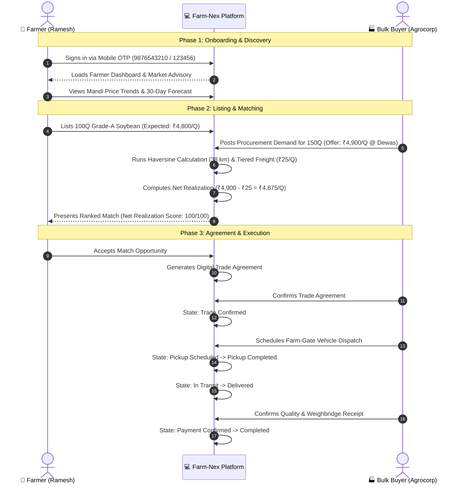
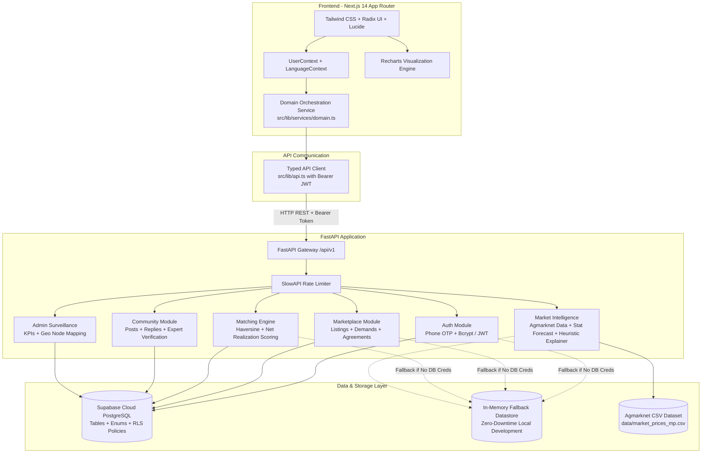

# Farm-Nex

**Logistics-aware agricultural marketplace and professional agri-network connecting smallholder farmers and FPOs directly with verified bulk buyers to maximize net farm-gate realization.**

---

## Overview

Agricultural commerce across India suffers from severe price opacity, multi-tiered brokerage, and deceptive headline prices. While a processor 200 km away might quote ₹5,050 per quintal for soybean, high road freight costs often make that offer less profitable than a ₹4,900 per quintal bid from a local mill 38 km away. Farmers frequently lack the analytical tools to factor freight deductions into spot negotiations, leading to avoidable revenue loss or distress sales to village-level intermediaries.

**Farm-Nex** solves this problem by introducing a **logistics-aware matching engine** where all buyer demands are ranked not by gross bid price, but by **Net Realization**—the exact cash amount remaining per quintal after deducting multi-axle freight costs calculated via haversine distance and tiered freight rates.

Farm-Nex also addresses the issue of "AI washing" in agriculture. Instead of using unverified generative AI or opaque black-box deep learning models that hallucinate predictions, Farm-Nex delivers **deterministic, transparent market intelligence**. Using historical mandi records from the Government of India's Agmarknet network across Madhya Pradesh, the platform calculates 30-day statistical price baselines (Moving Average blended with Single Exponential Smoothing, $\alpha = 0.3$) and provides rule-based economic explainers that trace price volatility directly to physical arrival volume shocks and statutory Minimum Support Price (MSP) benchmarks.

Built with Next.js 14, Tailwind CSS, FastAPI, and Supabase PostgreSQL (with a zero-dependency in-memory fallback), Farm-Nex provides dedicated workspaces for Farmers, Bulk Processors, Farmer Producer Organizations (FPOs), Consumers, and System Administrators.

---

## The Problem

Smallholder farmers and agricultural enterprises in India face four structural barriers:

1. **Information Asymmetry & Phantom Pricing**: Farmers see mandi headline prices but cannot easily determine whether distant buyer bids will remain profitable after accounting for transport, loading, and distance decay.
2. **Intermediary Margin Erosion**: Traditional agricultural supply chains pass produce through 3 to 5 middlemen legs (village aggregators, commission agents, regional mandi traders, transport brokers), shedding ₹85 to ₹120 per quintal in commissions and multiple handling charges.
3. **Unreliable Black-Box Predictions**: Modern agri-tech platforms often deploy unverified generative AI or synthetic "price predictors" that lack verifiable training baselines. When opaque algorithms fail, farmers absorb catastrophic financial losses.
4. **Disjointed Trade Workflows**: From discovery to weighing, hauling, and invoicing, transactions are negotiated over informal phone calls with zero binding audit trails, exposing both farmers and buyers to payment defaults and unfulfilled delivery commitments.

---

## The Solution

Farm-Nex combines direct digital procurement with deterministic analytics and trade lifecycle management:

- **Net Realization Ranking**: Every buyer match computes distance, applies a tiered logistics tariff, subtracts freight per quintal from the buyer's bid, and surfaces the true net earnings.
- **Statutory & Transparent Intelligence**: Mandi market trends and price forecasts are calculated strictly using verifiable statistical methods (rolling averages and exponential smoothing) paired with rule-based economic heuristics based on real Agmarknet mandi data.
- **Binding 8-Stage Trade Lifecycle**: Accepted matches transition through an explicit state machine with milestone audit logs, verifiable weighbridge details, and delivery confirmations.
- **Multi-Stakeholder Workspaces**: Tailored interfaces for individual farmers, collective FPOs pooling regional harvests, bulk industrial mills, direct-sourcing consumers, and regulatory platform admins.

---

## Key Features

### 🚜 Farmer Workspace & Produce Listings
- **Produce Listing Form**: List crop batches with commodity type (Soybean, Wheat, Cotton), quantity in quintals, quality grade (Grade A, B, C, FAQ), moisture percentage, harvest date, location coordinates, and minimum expected farm-gate price.
- **My Produce Dashboard**: View active, matched, in-transit, and delivered crop listings with instant deletion/withdrawal capability.
- **Smart Sell / Best Match Discovery**: Enter produce volume and location to evaluate matching buyers ranked dynamically by net realization per quintal.

### 🏭 Bulk Buyer Procurement
- **Procurement Demand Posts**: Industrial mills and food processors publish bulk buying tenders with required volume, acceptable quality grade, moisture ceiling, offered gross price per quintal, delivery location, and payment terms.
- **Demand Lifecycle Management**: Track active requirements, monitor inbound farmer responses, and withdraw fulfilled tenders.
- **Direct Farmer Discovery**: Browse verified regional supply lots with filtering by commodity and delivery status.

### ⚖️ Logistics-Aware Smart Matching Engine
- **Haversine Distance Calculation**: Accurately measures spherical distance in kilometers between farm-gate origin and mill processing facility.
- **Tiered Freight Estimation**:
  - Base tariff: ₹0.35 per quintal-kilometer for trips up to 100 km.
  - Long-haul efficiency discount: 10% reduction on marginal distance beyond 100 km (₹0.315 per quintal-km).
  - Minimum freight charge: ₹25.00 per quintal to cover fixed loading/drayage costs.
- **Multi-Factor Match Scoring**:
  $$\text{Match Score} = 0.45(S_{\text{net}}) + 0.20(S_{\text{price}}) + 0.15(S_{\text{dist}}) + 0.08(S_{\text{qty}}) + 0.05(S_{\text{qual}}) + 0.05(S_{\text{rel}}) + 0.02(S_{\text{avail}})$$
- **Transparent Match Explanations**: Surfaces human-readable rationales (e.g., *"Net realization exceeds your minimum expectation"*, *"Only 38 km away"*, *"Needs your full quantity"*).

### 📈 Transparent Market Intelligence
- **Agmarknet Price Trends**: Interactive historical mandi modal prices (1-month, 3-month, 6-month, and 1-year windows) for major Madhya Pradesh trading hubs (Indore, Dewas, Ujjain, Sehore, Khandwa).
- **Deterministic Demand Forecasting**:
  - 30-day baseline moving average blended with Single Exponential Smoothing ($\alpha = 0.3$).
  - Formula:
    $$\text{Forecast} = 0.65 \times \text{ExpSmooth}_{14\text{d}} + 0.35 \times \text{MovingAvg}_{30\text{d}}$$
  - Displays calculation methodology, confidence tier, and projected price direction (`upward`, `stable`, `downward`) without black-box generative AI.
- **"Why Price Moved" Economic Explainer**:
  - Compares the most recent 14 trading days against the preceding 14-day baseline for physical mandi arrival volumes and prices.
  - Evaluates supply shocks ($>15\%$ arrival surge or $<-15\%$ contraction).
  - Evaluates commodity-specific drivers (e.g., Government MSP floor parity at ₹4,892/Q for Soybean, roller flour mill pipeline demand for Wheat, spinning cluster off-take for Cotton).

### 🔄 Trade Agreement & 8-Stage Order Lifecycle
- **Digital Trade Agreements**: Generates binding digital trade summaries upon match acceptance with locked price per quintal, agreed quantity, freight deduction breakdown, and facilitation fees.
- **Strict State Machine**: Enforces logical sequential status transitions:
  $$\text{Matched} \rightarrow \text{Trade Confirmed} \rightarrow \text{Pickup Scheduled} \rightarrow \text{Pickup Completed} \rightarrow \text{In Transit} \rightarrow \text{Delivered} \rightarrow \text{Payment Confirmed} \rightarrow \text{Completed}$$
- **Role-Based Access Control**: Prevents unauthorized participants from advancing trade states; synchronizes underlying produce listings with delivery progression.

### 👥 Agricultural Community & Professional Network
- **Discussion Board**: Filterable agronomic and trade threads categorized by tags (`question`, `market`, `machinery`, `expert_verified`).
- **Threaded Replies**: Interactive peer discussions between farmers, agronomists, and procurement officers.
- **Admin Expert Verification**: Platform administrators can verify and mark technically sound agronomic advice with an **Expert Verified** trust badge.

### 🛡️ Platform Surveillance & Administrative Operations
- **System KPIs**: Real-time aggregation of active listings, buyer demand, contracted trade agreements, total trade volume in quintals, and estimated cumulative logistics savings generated by disintermediation.
- **Spatial Node Mapping**: Geospatial coordinate API (`/admin/map-nodes`) providing supply (farmer listings) and demand (buyer processing plants) coordinates across Madhya Pradesh.
- **Dispute Resolution & Trust Governance**: Administrative workflow for inspecting flagged transactions and managing user verification status.

---

## What Makes This Different

| Metric / Dimension | Traditional APMC Mandi | Generic Agri-Tech Startups | Farm-Nex |
|---|---|---|---|
| **Price Metric Displayed** | Gross mandi auction price | Gross buyer bid price | **Net Realization** (Gross bid minus calculated logistics freight) |
| **Logistics Accounting** | Farmer arranges and bears all unbudgeted freight costs | Buyer/Farmer left to handle logistics offline | **Integrated Haversine tiered freight modeling** directly inside matching engine |
| **Market Intelligence** | Verbal hearsay from commission agents (*arhtiyas*) | Opaque / Hallucinating black-box generative AI | **Deterministic statistical models** (30d MA + Exponential Smoothing $\alpha=0.3$) from verified Agmarknet data |
| **Price Shift Rationale** | None | Generalized synthetic chat responses | **Rule-based heuristic explainer** comparing 14-day arrival volume elasticity with MSP benchmarks |
| **Trade Audit Trail** | Paper slips (*kaccha parchi*), high counterparty risk | Unstructured phone calls and chats | **8-stage digital trade agreement state machine** with role permissions |
| **Intermediary Costs** | High multi-tier commission (₹85–₹120/Q) | Variable opaque brokerage cuts | **Transparent facilitation model** (~₹35/Q direct logistics) |

---

## User Journey



---

## System Architecture

Farm-Nex is architected as a decoupled, resilient application with clear separation between frontend client interfaces, domain orchestrators, RESTful backend services, and persistence engines.



---

## Tech Stack

### Frontend
- **Framework**: Next.js 14 (App Router)
- **Language**: TypeScript (strict type checking enabled)
- **UI & Styling**: Tailwind CSS, PostCSS, Radix UI Slot primitives, Class Variance Authority (`cva`), `clsx`, `tailwind-merge`
- **Data Visualization**: Recharts (Responsive SVG historical price trends)
- **Icons**: Lucide React
- **Internationalization**: Custom React `LanguageContext` supporting English and Hindi (`hi`)

### Backend
- **Framework**: FastAPI 0.110+ (Python 3.10+)
- **Server**: Uvicorn (ASGI standard)
- **Validation & Schemas**: Pydantic v2 & Pydantic-Settings
- **Security & Authentication**: PyJWT (HS256 JSON Web Tokens), Passlib with Bcrypt password hashing
- **Rate Limiting**: SlowAPI (10 requests/min on auth, 60 requests/min default)
- **CORS**: Permissive hackathon development CORS with production allowlist configuration

### Data Processing & Analytics
- **Data Series**: Pandas 2.2+, NumPy 1.26+
- **Distance Calculation**: Python standard `math` implementing the spherical Haversine formula
- **Testing**: PyTest 8.0+, PyTest-Asyncio, HTTPX

### Database & Storage
- **Primary Database**: Supabase PostgreSQL with custom ENUMs, relational foreign keys, cascade constraints, and Row-Level Security (RLS) policies
- **Zero-Downtime Fallback**: Integrated in-memory Python datastore (`InMemoryStore`) pre-seeded with realistic Madhya Pradesh producers, verified buyers, and demand posts for immediate local evaluation without external credentials
- **Dataset**: Official historical daily mandi modal prices and arrivals from Agmarknet (Sept 2025 – Aug 2026) for Soybean, Wheat, and Cotton across MP districts

---

## Project Structure

```text
FARM-NEX/
├── backend/                         # FastAPI Python backend application
│   ├── app/
│   │   ├── api/                     # REST API modular route handlers
│   │   │   ├── admin.py             # Platform surveillance & map node endpoints
│   │   │   ├── auth.py              # Farmer OTP, buyer login/register, JWT token handling
│   │   │   ├── community.py         # Discussion board, replies, expert verification
│   │   │   ├── intelligence.py      # Agmarknet price trends, forecasting, why-price-moved
│   │   │   ├── marketplace.py       # Crop listings, demand posts, trade agreements
│   │   │   └── matching.py          # Haversine distance, freight, net realization engine
│   │   ├── core/                    # Core application infrastructure
│   │   │   ├── config.py            # Environment settings and freight/matching parameters
│   │   │   ├── database.py          # Supabase client initialization & in-memory fallback store
│   │   │   ├── limiter.py           # SlowAPI rate limiter instance
│   │   │   └── security.py          # Bcrypt password hashing, JWT encoder/decoder, RBAC
│   │   ├── models/
│   │   │   └── schemas.py           # Pydantic request/response validation schemas
│   │   └── main.py                  # FastAPI application entry point, CORS, and routers
│   ├── db/
│   │   └── schema.sql               # PostgreSQL schema definition and RLS policies
│   ├── tests/                       # Automated backend test suite (19 test cases)
│   │   ├── test_admin.py
│   │   ├── test_auth.py
│   │   ├── test_intelligence.py
│   │   ├── test_marketplace.py
│   │   ├── test_matching.py
│   │   └── test_phase5.py
│   ├── .env.example                 # Template for backend environment variables
│   └── requirements.txt             # Python backend dependencies
├── data/                            # Market intelligence data assets
│   ├── DATA_SOURCES.md              # Public data citations (Agmarknet, DMI, Govt of India)
│   ├── generate_dataset.py          # Agmarknet data ingestion and interpolation script
│   └── market_prices_mp.csv         # Mandi daily records (Soybean, Wheat, Cotton)
├── docs/
│   └── FEATURE_ENDPOINT_MATRIX.md   # Architectural matrix mapping frontend views to APIs
├── frontend/                        # Next.js 14 TypeScript web client
│   ├── src/
│   │   ├── app/                     # Next.js App Router route hierarchy
│   │   │   ├── admin/               # Platform administration & surveillance pages
│   │   │   ├── buyer/               # Bulk procurement & buyer discovery workspace
│   │   │   ├── community/           # Community discussion board
│   │   │   ├── consumer/            # Direct-to-consumer farm produce catalog
│   │   │   ├── farmer/              # Farmer workspace, smart-sell, produce listings
│   │   │   ├── fpo/                 # FPO collective aggregation workspace
│   │   │   ├── intelligence/        # Recharts market price trend & forecast dashboard
│   │   │   ├── marketplace/         # Unified supply and demand discovery catalog
│   │   │   ├── messages/            # Messaging and trade communications
│   │   │   ├── network/             # Professional agri-network feed
│   │   │   ├── orders/              # Trade agreement tracking & order lifecycle
│   │   │   ├── layout.tsx           # Global shell, navigation bar, and providers
│   │   │   └── page.tsx             # Main landing page with 5 one-click demo logins
│   │   ├── components/              # Shared UI components (Radix primitives, TrustBadge)
│   │   └── lib/                     # Client infrastructure
│   │       ├── api.ts               # Typed fetch wrapper with Bearer token injection
│   │       ├── auth/UserContext.tsx # User session, authentication & demo persona state
│   │       ├── data/demo.ts         # Structured development records & fallback dataset
│   │       ├── i18n/LanguageContext # Multilingual dictionary provider (English / Hindi)
│   │       ├── navigation.ts        # Role-based redirection and breadcrumbs
│   │       └── services/domain.ts   # Hybrid data orchestrator (FastAPI with demo fallback)
│   ├── .env.example                 # Template for frontend environment variables
│   ├── package.json                 # Frontend dependencies and scripts
│   ├── tailwind.config.ts           # Custom agricultural theme and responsive design tokens
│   └── tsconfig.json                # TypeScript compiler configuration
├── supabase/
│   └── migrations/
│       └── 001_initial_schema.sql   # Supabase DDL migrations and RLS definitions
└── README.md
```

---

## Getting Started

Follow these steps to run Farm-Nex locally on your machine.

### Prerequisites
- **Node.js**: `v18.0.0` or higher
- **npm**: `v9.0.0` or higher
- **Python**: `3.10` or `3.12`
- **Git**

---

### Step 1: Clone the Repository

```bash
git clone https://github.com/ompatel/FARM-NEX.git
cd FARM-NEX
```

---

### Step 2: Backend Setup (FastAPI)

1. Open a new terminal and navigate to the `backend` directory:
   ```bash
   cd backend
   ```

2. Create and activate a Python virtual environment:
   ```bash
   # On macOS / Linux:
   python3 -m venv venv
   source venv/bin/activate

   # On Windows (Command Prompt):
   python -m venv venv
   venv\Scripts\activate.bat

   # On Windows (PowerShell):
   python -m venv venv
   venv\Scripts\Activate.ps1
   ```

3. Install backend dependencies:
   ```bash
   pip install -r requirements.txt
   ```

4. Configure environment variables:
   ```bash
   cp .env.example .env
   ```
   *(The default `.env` is pre-configured to run with the zero-dependency in-memory datastore. No Supabase credentials are required for local evaluation.)*

5. Run backend automated tests to verify your environment:
   ```bash
   PYTHONPATH=. pytest tests
   ```
   *(Expected output: 19 passed test cases across auth, intelligence, marketplace, matching, and admin.)*

6. Start the FastAPI server:
   ```bash
   uvicorn app.main:app --reload --host 0.0.0.0 --port 8000
   ```
   The backend API will start at `http://localhost:8000`.
   - Interactive Swagger API Documentation: `http://localhost:8000/docs`
   - ReDoc Alternative Documentation: `http://localhost:8000/redoc`
   - Health Check Endpoint: `http://localhost:8000/health`

---

### Step 3: Frontend Setup (Next.js)

1. Open a second terminal and navigate to the `frontend` directory:
   ```bash
   cd frontend
   ```

2. Install frontend dependencies:
   ```bash
   npm install
   ```

3. Configure environment variables:
   ```bash
   cp .env.example .env.local
   ```
   Verify that `NEXT_PUBLIC_API_URL` points to `http://localhost:8000/api/v1`.

4. Start the Next.js development server:
   ```bash
   npm run dev
   ```
   The frontend application will start at `http://localhost:3000`.

---

## Environment Variables

### Backend (`backend/.env`)

| Variable Name | Required | Default / Example Value | Description |
|---|---|---|---|
| `APP_NAME` | No | `Farm-Nex` | Application display name |
| `ENVIRONMENT` | No | `development` | Runtime environment (`development` / `production`) |
| `API_V1_STR` | No | `/api/v1` | Base API URL prefix |
| `SUPABASE_URL` | Optional | `https://your-project.supabase.co` | Supabase project URL (falls back to memory store if omitted) |
| `SUPABASE_KEY` | Optional | `your-anon-public-key` | Supabase anonymous API key |
| `SUPABASE_SERVICE_ROLE_KEY` | Optional | `your-service-role-key` | Supabase service role key for admin tasks |
| `JWT_SECRET_KEY` | Recommended | `farm-nex-sih2026-super-secure-jwt-secret-key-32chars` | 32+ character secret for signing HS256 JWT tokens |
| `JWT_ALGORITHM` | No | `HS256` | JWT cryptographic algorithm |
| `ACCESS_TOKEN_EXPIRE_MINUTES` | No | `10080` | JWT token validity window (10080 min = 7 days) |
| `RATE_LIMIT_DEFAULT` | No | `60/minute` | Global rate limit applied by SlowAPI |
| `RATE_LIMIT_AUTH` | No | `10/minute` | Strict rate limit on OTP and login endpoints |

### Frontend (`frontend/.env.local`)

| Variable Name | Required | Default / Example Value | Description |
|---|---|---|---|
| `NEXT_PUBLIC_APP_NAME` | No | `Farm-Nex` | Client application display title |
| `NEXT_PUBLIC_API_URL` | Yes | `http://localhost:8000/api/v1` | URL of the running FastAPI backend |
| `NEXT_PUBLIC_SUPABASE_URL` | Optional | `https://your-project.supabase.co` | Supabase client endpoint |
| `NEXT_PUBLIC_SUPABASE_ANON_KEY` | Optional | `your-anon-public-key` | Supabase client anonymous API key |
| `NEXT_PUBLIC_DEMO_MODE` | No | `true` | When `true`, frontend falls back to demo data if backend is unreachable |

> [!NOTE]
> Never commit actual API keys, database connection strings, or JWT secrets to source control.

---

## Demo & Evaluation Guide

Farm-Nex is designed for zero-friction evaluation by hackathon judges and evaluators without requiring complex third-party account setups.

### Instant One-Click Demo Personas
On the landing page (`http://localhost:3000`), a quick evaluation strip provides instant one-click login for 5 pre-configured personas:

1. **🌾 Ramesh Patel (Farmer)**:
   - Location: Indore, Madhya Pradesh
   - Pre-seeded with 100Q Grade-A Soybean harvest.
   - Accesses `/farmer` and `/farmer/buyers` to evaluate matched buyers ranked by Net Realization.
2. **🏢 Malwa FPO (Collective Organization)**:
   - Aggregates smallholder member lots across Malwa district.
   - Accesses `/fpo` to monitor collection centers, pooled supply batches, and bulk tenders.
3. **🏭 Agrocorp Central Processing (Bulk Buyer)**:
   - Industrial processing mill located in Dewas Industrial Area (38 km from Indore).
   - Accesses `/buyer` to broadcast bulk procurement demands and track contracted logistics dispatches.
4. **🥗 Meera (Consumer)**:
   - Direct-to-farm buyer sourcing chemical-free produce.
   - Accesses `/consumer` to browse verified lots and track orders.
5. **🛡️ Operations (Platform Administrator)**:
   - Accesses `/admin` to inspect real-time platform KPIs, trade volume, cumulative freight savings, geospatial node maps, and verify community agronomic advice.

### Manual Credentials
- **Farmer Login**: Mobile number `9876543210` with verification OTP `123456`.
- **Buyer Login**: Email `buyer1@agrocorp.in` with password `demo1234`.

---

## Product Preview

Below is an overview of the core interfaces available in the local application:

| Workspace / View | Route | Primary Action |
|---|---|---|
| **Landing & Onboarding** | `/` | Switch between role perspectives; evaluate one-click personas; view core architectural pillars. |
| **Farmer Dashboard** | `/farmer` | Overview of active harvest lots, pending buyer match requests, and mandi price alerts. |
| **Smart Sell & Net Realization** | `/farmer/buyers` | Dynamic ranking of buyers subtracting road freight costs per quintal; plain-language match explanations. |
| **Produce Listing Creator** | `/farmer/produce/new` | Multi-step crop batch registration with moisture content, grade, and farm coordinates. |
| **Buyer Procurement Portal** | `/buyer/procurement` | Industrial tender publishing with quality requirements and delivery schedules. |
| **Market Intelligence** | `/intelligence` | Interactive Recharts historical Agmarknet price charts, 30-day forecast, and economic price move explainer. |
| **Trade Agreements & Deals** | `/orders` | 8-stage state machine tracking trade progression from agreement to payment settlement. |
| **Agricultural Network** | `/network` | Community discussion board with threaded replies and expert-verified agronomic advice tags. |
| **Admin Surveillance & Map** | `/admin` | Macro platform KPIs, cumulative logistics savings in INR, and geospatial MP supply/demand nodes. |

---

## SIH Context

### Smart India Hackathon (SIH) 2026

- **Problem Statement ID**: `26033`
- **Domain / Theme**: Agriculture, Food Technology & Rural Development / Smart Agricultural Marketplace & Supply Chain Optimization
- **Government Challenge Alignment**: Addressing farm-gate price realization disparities, eliminating predatory middleman commissions, and improving logistical efficiency for farmers and Farmer Producer Organizations (FPOs).

### How Farm-Nex Directly Solves the SIH Challenge
1. **Targeted Value Capture (Net Realization)**: Rather than merely providing an online classifieds board, Farm-Nex solves the fundamental mathematical challenge: *Where should a farmer sell to maximize take-home income after paying for transport?*
2. **Data Honesty & Algorithmic Explainability**: Avoids black-box AI hallucinations that can mislead farmers. Every prediction and economic explainer is grounded in verified Agmarknet historical auction records with transparent mathematical formulas.
3. **Structured Trade Execution**: Provides an 8-stage verifiable state machine from agreement to payment confirmation, mitigating delivery defaults and payment disputes in agricultural trade.
4. **FPO Support**: Enables FPOs to aggregate smallholder volume into bulk commercial lots that qualify for industrial processor procurement tenders.

---

## Roadmap

### ✅ Implemented
- [x] Role-Based Access Control (Farmer OTP simulation, Buyer Email/Password, Admin).
- [x] JWT token authentication with bcrypt password hashing and SlowAPI rate limiting.
- [x] Crop listing management (commodity, grade, moisture, harvest date, location, expected price).
- [x] Bulk buyer procurement demand posting and management.
- [x] Logistics-aware matching engine with spherical Haversine distance calculation.
- [x] Tiered freight cost calculation with long-haul efficiency discounts.
- [x] Net realization scoring and transparent human-readable match explanations.
- [x] Interactive Agmarknet historical price trend visualization using Recharts (1m, 3m, 6m, 1y).
- [x] Deterministic 30-day demand forecast model combining Moving Average and Exponential Smoothing ($\alpha = 0.3$).
- [x] Rule-based economic explainer analyzing 14-day arrival volume elasticity vs. MSP benchmarks.
- [x] Digital trade agreement creation upon match acceptance.
- [x] 8-stage trade lifecycle state machine with validation checks.
- [x] Community discussion forum with threaded replies and admin expert verification.
- [x] Admin surveillance dashboard with platform KPIs and MP geospatial supply/demand nodes.
- [x] Bilingual interface support (English and Hindi).
- [x] 19 automated PyTest unit and integration tests.
- [x] Dual-mode data persistence (Supabase PostgreSQL + zero-dependency in-memory fallback).

### 🚧 In Progress
- [ ] Production SMS gateway integration (Fast2SMS / MSG91) for live phone OTP delivery.
- [ ] Integration with Ministry of Road Transport & Highways (MoRTH) Vahan API for live vehicle registration checks.
- [ ] Integration of official GSTN / DigiLocker verification APIs for automated buyer enterprise KYC.
- [ ] Mandi geofencing to detect physical vehicle entry at destination weighbridges.

### 📋 Planned
- [ ] UPI 2.0 / e-RUPI integration for automated milestone-based escrow payment settlement.
- [ ] Integration with Indian Meteorological Department (IMD) agromet advisories for harvest timing and weather warnings.
- [ ] Offline-first Progressive Web App (PWA) support with background synchronization for low-connectivity rural belts.
- [ ] Multi-axle truck consolidation tool to pool smallholder lots into single 16-tonne transport trips.

---

## Security & Reliability

- **Authentication**: Stateless JSON Web Tokens (PyJWT) using the HS256 signature algorithm with a 7-day expiration window.
- **Password Security**: One-way cryptographic hashing using Bcrypt (`passlib[bcrypt]`).
- **Endpoint Protection**: SlowAPI middleware prevents brute-force credential stuffing (10 requests/minute on auth routes) and DDoS attacks (60 requests/minute on general endpoints).
- **Data Validation**: Strict Pydantic v2 schemas sanitize all inbound request payloads and enforce typed response contracts.
- **Database Access Control**: PostgreSQL Row-Level Security (RLS) policies restrict users from editing or deleting produce listings, demands, and agreements that they do not own.
- **Resilience**: In-memory datastore fallback ensures zero downtime and uninterrupted evaluation even if cloud database connectivity is unavailable.

---

## Contributing

Contributions to Farm-Nex are welcome. To contribute:

1. Fork the repository.
2. Create a feature branch:
   ```bash
   git checkout -b feature/your-feature-name
   ```
3. Ensure backend tests pass:
   ```bash
   cd backend && PYTHONPATH=. pytest tests
   ```
4. Verify frontend TypeScript compilation:
   ```bash
   cd frontend && npx tsc --noEmit
   ```
5. Commit your changes with clear, descriptive commit messages.
6. Push to your branch and open a Pull Request.

---

## License

This project is currently developed for academic and competition evaluation under the Smart India Hackathon (SIH) 2026. A formal open-source license (such as MIT or Apache 2.0) will be designated upon public hackathon release.

---

## Data Disclaimer

Market data used in Farm-Nex is sourced from public market bulletins published by the **Directorate of Marketing & Inspection (DMI), Ministry of Agriculture & Farmers Welfare, Government of India** via [Agmarknet](https://agmarknet.gov.in). Statistical baselines and economic explainers are provided for analytical reference and market transparency; they do not constitute financial guarantees or certified agricultural commodity trading advice.
